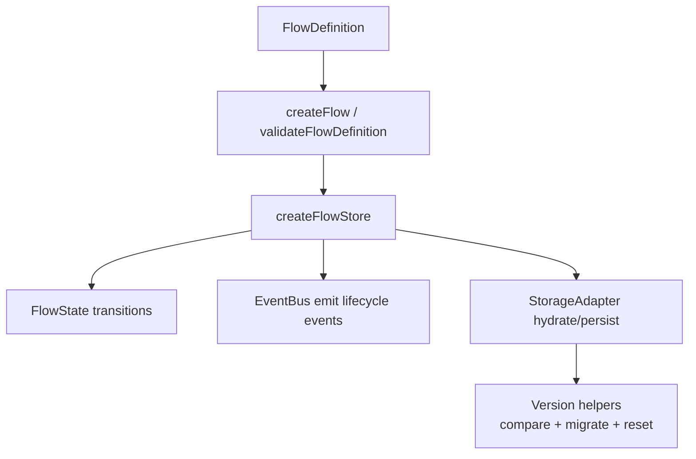

# @flowsterix/core Maintainer Documentation

This is the maintainer-facing source of truth for `@flowsterix/core`.

It covers:

- package architecture and concepts
- runtime data flows
- capabilities map
- exhaustive API inventory for exported runtime values and types
- testing and release workflow

This document is implementation-oriented, not end-user onboarding.

## Quick Facts

- package root: `packages/core`
- source entry: `src/index.ts`
- package exports:
  - `@flowsterix/core`
- published outputs: `dist/*`
- package publishes only `dist`

## Purpose and Boundaries

`@flowsterix/core` contains the framework-agnostic tour engine:

- flow definition model (`FlowDefinition`, `Step`, advance rules, dialogs, HUD options)
- typed event bus
- flow store state machine (`createFlowStore`)
- storage adapters and snapshot abstractions
- schema validation (`zod`)
- version migration/resolution utilities

`@flowsterix/react` and other UI integrations should treat this package as runtime authority for state transitions and event semantics.

## Architecture Overview



## Core Concepts

- `FlowDefinition`:
  - declarative flow graph: steps, version, optional dialogs/hud/migration.
- `FlowState`:
  - runtime state snapshot with status, step index, version, timestamps.
- `FlowStore`:
  - transition API (`start`, `next`, `back`, `goToStep`, `pause`, `resume`, `cancel`, `complete`, `advanceStep`) plus subscription.
- `FlowEvents`:
  - typed lifecycle and step transition events.
- `StorageAdapter`:
  - pluggable persistence layer over `StorageSnapshot`.
- Version handling:
  - supports semantic comparison and migration/reset on mismatch.

## Runtime Data Flows

### 1. Definition Validation Path

1. Definition is created/validated via:
   - `createFlow`
   - `validateFlowDefinition`
   - `flowDefinitionSchema`
2. Cross-reference invariants are checked (for example dialog references).

### 2. Store Transition Path

1. `createFlowStore` initializes state and event bus.
2. Transition methods call internal `commit`.
3. `commit`:
   - updates normalized state
   - persists snapshot (if enabled)
   - emits lifecycle + step transition + state change events
   - notifies subscribers

### 3. Hydration + Version Resolution Path

1. Storage snapshot is loaded and validated.
2. Version mismatch is resolved via `handleVersionMismatch`:
   - `same` -> continue
   - `minor` -> step ID/index resolution
   - `major` -> migrate function if available, otherwise reset
3. Resulting state is committed and propagated.

### 4. Analytics Path

- `FlowAnalyticsHandlers` maps event names to callback handlers (e.g. `onFlowStart`, `onStepEnter`).
- Emitted in parallel with event bus dispatch from the store.

## Capabilities Matrix

| Capability | Primary APIs | Implementation |
| --- | --- | --- |
| Definition validation | `createFlow`, `validateFlowDefinition`, `flowDefinitionSchema` | `src/createFlow.ts`, `src/validation.ts` |
| Typed event bus | `createEventBus`, `EventBus` | `src/events.ts` |
| Flow state machine | `createFlowStore`, `FlowStore` | `src/state.ts` |
| Storage abstractions | `StorageAdapter`, `StorageSnapshot` | `src/storage.ts` |
| In-memory storage | `MemoryStorageAdapter` | `src/storage.ts` |
| Browser storage | `createLocalStorageAdapter` | `src/storage.ts` |
| API storage | `createApiStorageAdapter` | `src/storage.ts` |
| Promise normalization | `resolveMaybePromise`, `MaybePromise` | `src/storage.ts`, `src/types.ts` |
| Version compare/parse/serialize | `compareVersions`, `parseVersion`, `serializeVersion` | `src/version.ts` |
| Version mismatch resolution | `handleVersionMismatch`, `buildStepIdMap` | `src/version.ts` |
| Declarative data model/types | `FlowDefinition`, `Step`, etc. | `src/types.ts` |

## API Inventory (Exhaustive)

This inventory reflects everything exported from `src/index.ts`.

### Runtime Exports

- `createFlow`
- `createEventBus`
- `createFlowStore`
- `MemoryStorageAdapter`
- `createApiStorageAdapter`
- `createLocalStorageAdapter`
- `resolveMaybePromise`
- `flowDefinitionSchema`
- `validateFlowDefinition`
- `buildStepIdMap`
- `compareVersions`
- `handleVersionMismatch`
- `parseVersion`
- `serializeVersion`

### Type Exports

- Event bus/storage/store options:
  - `EventBus`
  - `EventHandler`
  - `EventKey`
  - `FlowStoreOptions`
  - `ApiStorageAdapterOptions`
  - `StorageAdapter`
  - `StorageSnapshot`
- Core model and runtime:
  - `MaybePromise`
  - `FlowStatus`
  - `FlowCancelReason`
  - `FlowVersion`
  - `FlowState`
  - `FlowStore`
  - `StartFlowOptions`
  - `ResumeStrategy`
- Steps and transition model:
  - `StepDirection`
  - `StepEnterReason`
  - `StepExitReason`
  - `StepCompleteReason`
  - `StepTransitionPayload`
  - `StepEnterEvent`
  - `StepExitEvent`
  - `StepCompleteEvent`
  - `StepPlacement`
  - `StepMask`
  - `HiddenTargetFallbackMode`
  - `ScrollMarginConfig`
  - `StepScrollMode`
  - `StepTargetBehavior`
  - `StepTarget`
  - `StepControlState`
  - `StepControls`
  - `StepWaitForSubscribeContext`
  - `StepWaitForPredicate`
  - `StepWaitForSubscribe`
  - `StepWaitFor`
  - `AdvancePredicateContext`
  - `AdvanceRule`
  - `StepHookContext`
  - `StepHook`
  - `Step`
- HUD and dialog config types:
  - `BackdropInteractionMode`
  - `FlowHudPopoverOptions`
  - `FlowHudBackdropOptions`
  - `FlowHudBehaviorOptions`
  - `FlowHudGuardElementFocusRing`
  - `FlowHudRenderMode`
  - `FlowHudTokenOverrides`
  - `FlowHudOptions`
  - `DialogAutoOpen`
  - `DialogAutoClose`
  - `DialogConfig`
- Version/migration types:
  - `VersionCompareResult`
  - `VersionMismatchAction`
  - `MigrationContext`
  - `FlowMigrateFn`
  - `VersionMismatchInfo`
- Error/event/analytics types:
  - `FlowDefinition`
  - `FlowErrorCode`
  - `FlowErrorEvent`
  - `FlowEvents`
  - `FlowAnalyticsHandlers`

## Files and Responsibilities

- Public API barrel:
  - `src/index.ts`
- Data model and contracts:
  - `src/types.ts`
- Validation:
  - `src/validation.ts`
  - `src/createFlow.ts`
- Event bus:
  - `src/events.ts`
- State machine:
  - `src/state.ts`
- Storage:
  - `src/storage.ts`
- Versioning and migration:
  - `src/version.ts`

## Invariants and Behavioral Rules

- `FlowDefinition.version` is required and serialized as `major.minor`.
- Store methods are async-aware through `MaybePromise`.
- Terminal states (`completed`, `cancelled`) are preserved across version mismatch.
- Minor version mismatch prefers `stepId` remap before fallback to valid index.
- Major mismatch uses `migrate` if present, otherwise resets.
- `advanceStep(stepId)` is guarded and no-ops unless current step matches.
- Storage hydration accepts legacy numeric version snapshots for backward compatibility.

## Debugging Checklist

1. Definition validation
- run through `createFlow`/`validateFlowDefinition`
- verify dialog references and step IDs

2. State transitions
- inspect `FlowState.status`, `stepIndex`, `cancelReason`, `updatedAt`
- confirm transition method called while status permits it

3. Event lifecycle
- verify event bus listeners for:
  - `stepEnter`, `stepExit`, `stepComplete`, `stepChange`, `stateChange`
  - `flowStart`, `flowResume`, `flowPause`, `flowCancel`, `flowComplete`

4. Persistence and hydration
- confirm `storageKey`, adapter behavior, and `persistOnChange`
- inspect snapshot shape and version format

5. Version mismatches
- check compare result (`same|minor|major`)
- check migration callback behavior and fallback reset path

## Local Workflow

Run from repo root:

```bash
pnpm --filter @flowsterix/core test
pnpm --filter @flowsterix/core typecheck
pnpm --filter @flowsterix/core build
```

Important:

- consuming apps generally execute `dist` artifacts
- source edits may require rebuild to be reflected in consuming runtime
- never hand-edit `dist`

## Current Tests

- `src/__tests__/events.test.ts`
- `src/__tests__/flowEvents.test.ts`
- `src/__tests__/storage.test.ts`
- `src/__tests__/validation.test.ts`
- `src/__tests__/version.test.ts`

When changing behavior:

- add/adjust tests in the corresponding domain (`state`, `storage`, `version`, `validation`, `events`)
- use deterministic tests for migration and persistence edge cases
- validate both sync and async adapter paths when touching commit/persist logic

## Release and Maintenance Checklist

1. Update implementation and tests.
2. Run:
   - `pnpm --filter @flowsterix/core test`
   - `pnpm --filter @flowsterix/core typecheck`
   - `pnpm --filter @flowsterix/core build`
3. Update `CHANGELOG.md`.
4. Update this README when:
   - exports change
   - invariants or migration semantics change
   - storage/version behavior changes
