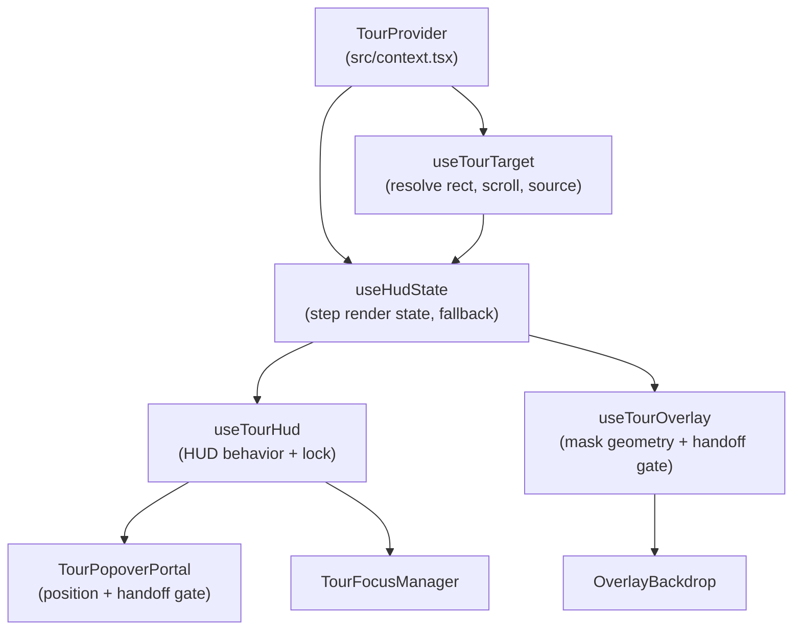

# @flowsterix/react Maintainer Documentation

This is the maintainer-facing source of truth for `@flowsterix/react`.

It covers:

- package concepts and architecture
- runtime data flows and state transitions
- capability coverage map
- exhaustive API inventory (main entry and subpath exports)
- test and release maintenance workflow

It is intentionally implementation-oriented and not end-user onboarding docs.

## Quick Facts

- package root: `packages/react`
- primary source entry: `src/index.tsx`
- published outputs: `dist/*`
- package exports:
  - `@flowsterix/react`
  - `@flowsterix/react/router`
  - `@flowsterix/react/router/tanstack`
  - `@flowsterix/react/router/react-router`
  - `@flowsterix/react/router/next-app`
  - `@flowsterix/react/router/next-pages`
  - `@flowsterix/react/devtools`

## Concepts and Core Model

`@flowsterix/react` is a React runtime around core flow state (`@flowsterix/core`) plus UI primitives and integration helpers.

Core concepts:

- Flow runtime:
  - Active flow and active step are sourced from the core store and exposed by `TourProvider`.
- Target resolution:
  - Step targets are resolved to element + rect snapshots (`useTourTarget`) with `rectSource` provenance.
- HUD composition:
  - `useHudState` and `useTourHud` derive renderability, fallback strategy, lock behavior, and UX metadata.
- Overlay and popover:
  - `useTourOverlay` computes cutout geometry.
  - `OverlayBackdrop` and `TourPopoverPortal` render visual primitives and transition behavior.
- Cross-step handoff:
  - Overlay and popover preserve cached position during resolving windows and promote to live rect on gating conditions.
- Motion strategy:
  - Motion can run as spring/tween/reduced via adapter abstraction.
- Router gating:
  - Route signals can pause/resume or advance flows through route-aware hooks and adapters.

## Architecture Map



## Runtime Data Flows

### 1. Step to Target to HUD

1. `TourProvider` exposes `activeFlowId`, `activeStep`, `state`.
2. `useTourTarget` resolves target:
- selector/getNode/screen resolution
- viewport/observer/raf updates
- `rectSource` assignment (`none|live|stored|viewport`)
- step-enter scroll and auto-scroll safeguards
3. `useHudState` combines flow state and target state:
- route mismatch handling
- hidden/missing fallback via `useHiddenTargetFallback`
- grace-period behavior and render gating
4. `useTourHud` derives:
- overlay config
- popover config
- body scroll lock + constrained mode

### 2. Overlay and Popover Handoff Gate

Problem:

- During cross-step smooth scroll, live rect can be in transient positions.
- Immediate promotion causes visual jumps or settle artifacts.

Solution:

- Keep cached previous rect during handoff.
- Promote to live when:
  - visibility gate passes (fitted vs oversized thresholds)
  - and motion gate passes:
    - settle-by-time, or
    - settle-by-speed

Current handoff logic is implemented in:

- `src/hooks/useTourOverlay.ts`
- `src/components/TourPopoverPortal.tsx`

Both should stay aligned unless divergence is deliberate.

### 3. Scroll and Lock Behavior

- Normal lock path: `useBodyScrollLock`
- Oversized target path: `useConstrainedScrollLock`
- Margin semantics: `scrollMargin.ts`
- Target auto-scroll entry + redispatch safeguards: `useTourTarget.ts`

## Capability Coverage Matrix

| Capability | Primary APIs | Implementation |
| --- | --- | --- |
| Flow runtime provider | `TourProvider`, `useTour`, `useTourEvents` | `src/context.tsx` |
| Labels/i18n surface | `defaultLabels`, `useTourLabels` | `src/labels.ts` |
| Target acquisition and rect provenance | `useTourTarget` | `src/hooks/useTourTarget.ts` |
| HUD state derivation | `useHudState`, `useTourHud` | `src/hooks/useHudState.ts`, `src/hooks/useTourHud.ts` |
| Hidden/missing fallback handling | `useHiddenTargetFallback` | `src/hooks/useHiddenTargetFallback.ts` |
| Overlay geometry and mask state | `useTourOverlay`, `OverlayBackdrop` | `src/hooks/useTourOverlay.ts`, `src/components/OverlayBackdrop.tsx` |
| Popover positioning modes and persistence | `TourPopoverPortal` | `src/components/TourPopoverPortal.tsx` |
| Focus dominance and trap management | `useTourFocusDominance`, `TourFocusManager` | `src/hooks/useTourFocusDominance.ts`, `src/components/TourFocusManager.tsx` |
| Tour controls state | `useTourControls` | `src/hooks/useTourControls.ts` |
| Delay progress | `useDelayAdvance` | `src/hooks/useDelayAdvance.ts` |
| Motion abstraction and strategy | adapter exports + `useHudMotion` | `src/motion/*` |
| Body lock and constrained lock | `useBodyScrollLock`, `useConstrainedScrollLock` | `src/hooks/useBodyScrollLock.ts`, `src/hooks/useConstrainedScrollLock.ts` |
| Route channel and matching | `getCurrentRoutePath`, `notifyRouteChange`, `subscribeToRouteChanges`, `createPathString`, `matchRoute` | `src/router/routeGating.ts`, `src/router/utils.ts` |
| Framework router adapters | router subpath hooks/components | `src/router/*Adapter.tsx`, `src/router/tanstackRouterSync.tsx` |
| Radix dialog integration | `useRadixDialogAdapter`, `useRadixTourDialog`, registry exports | `src/adapters/radixDialog.ts`, `src/hooks/useRadixTourDialog.ts`, `src/dialog/DialogRegistryContext.tsx` |
| DevTools surface | `@flowsterix/react/devtools` exports | `src/devtools/*` |

## API Inventory (Exhaustive)

This section is intended to cover every exported identifier in source.

### Main Entry: `@flowsterix/react`

#### Runtime exports

- Core runtime:
  - `TourProvider`
  - `useTour`
  - `useTourEvents`
- Labels:
  - `defaultLabels`
  - `useTourLabels`
- Target and HUD hooks:
  - `useTourTarget`
  - `useHudState`
  - `useHudDescription`
  - `useHudShortcuts`
  - `useTourHud`
  - `useTourOverlay`
  - `useHudTargetIssue`
- Dialog and registry:
  - `useRadixDialogAdapter`
  - `waitForDom`
  - `useRadixTourDialog`
  - `DialogRegistryProvider`
  - `useDialogRegistry`
  - `useDialogRegistryOptional`
- Focus and controls:
  - `useTourFocusDominance`
  - `useTourControls`
  - `useDelayAdvance`
- Components:
  - `OverlayBackdrop`
  - `TourPopoverPortal`
  - `TourFocusManager`
- Motion:
  - `AnimationAdapterProvider`
  - `defaultAnimationAdapter`
  - `reducedMotionAnimationAdapter`
  - `tweenAnimationAdapter`
  - `useAnimationAdapter`
  - `usePreferredAnimationAdapter`
  - `useHudMotion`
- Low-level hooks/utilities:
  - `useAdvanceRules`
  - `useBodyScrollLock`
  - `useConstrainedScrollLock`
  - `useHiddenTargetFallback`
  - `useViewportRect`
  - `createWaitForPredicateController`
- Router utility exports (main entry safe subset):
  - `getCurrentRoutePath`
  - `notifyRouteChange`
  - `subscribeToRouteChanges`
  - `createPathString`

#### Type exports

- Context/provider:
  - `DelayAdvanceInfo`
  - `TourContextValue`
  - `TourProviderProps`
- Labels:
  - `TourLabels`
- Target:
  - `TourTargetInfo`
- HUD state and hooks:
  - `UseHudStateOptions`
  - `UseHudStateResult`
  - `UseHudDescriptionOptions`
  - `UseHudDescriptionResult`
  - `UseHudShortcutsOptions`
  - `TourHudDescription`
  - `TourHudFocusManagerState`
  - `TourHudOverlayConfig`
  - `TourHudPopoverConfig`
  - `UseTourHudOptions`
  - `UseTourHudResult`
  - `HudTargetIssue`
  - `UseHudTargetIssueOptions`
  - `UseHudTargetIssueResult`
- Overlay and popover:
  - `TourOverlayRect`
  - `TourOverlaySegment`
  - `UseTourOverlayOptions`
  - `UseTourOverlayResult`
  - `OverlayBackdropProps`
  - `OverlayBackdropTransitionsOverride`
  - `TourPopoverLayoutMode`
  - `TourPopoverPortalProps`
  - `TourPopoverPortalRenderProps`
  - `TourFocusManagerProps`
- Dialog:
  - `RadixDialogAdapterResult`
  - `UseRadixDialogAdapterOptions`
  - `UseRadixTourDialogParams`
  - `UseRadixTourDialogResult`
  - `DialogController`
  - `DialogRegistryContextValue`
- Focus, controls, delay:
  - `UseTourFocusDominanceOptions`
  - `UseTourFocusDominanceResult`
  - `TourControlsState`
  - `DelayAdvanceProgress`
- Motion:
  - `AnimationAdapter`
  - `AnimationAdapterComponents`
  - `AnimationAdapterProviderProps`
  - `AnimationAdapterTransitions`
  - `UseAnimationAdapterOptions`
  - `UseHudMotionResult`
- Scroll/fallback/predicate:
  - `ConstrainedScrollLockOptions`
  - `UseHiddenTargetFallbackConfig`
  - `UseHiddenTargetFallbackResult`
  - `WaitForPredicateController`
  - `WaitForPredicateControllerOptions`

### Subpath: `@flowsterix/react/router`

Runtime exports:

- `getCurrentRoutePath`
- `matchRoute`
- `notifyRouteChange`
- `routeGatingChannel`
- `subscribeToRouteChanges`
- `createPathString`

### Subpath: `@flowsterix/react/router/tanstack`

Runtime exports:

- `useTanStackRouterTourAdapter`
- `getTanStackRouter`
- `getTourRouter`
- `setTanStackRouter`
- `setTourRouter`
- `TanStackRouterSync`

Type exports:

- `TanStackRouterSyncProps`

### Subpath: `@flowsterix/react/router/react-router`

Runtime exports:

- `useReactRouterTourAdapter`

### Subpath: `@flowsterix/react/router/next-app`

Runtime exports:

- `useNextAppRouterTourAdapter`

### Subpath: `@flowsterix/react/router/next-pages`

Runtime exports:

- `useNextPagesRouterTourAdapter`

### Subpath: `@flowsterix/react/devtools`

Runtime exports:

- Provider/context:
  - `DevToolsProvider`
  - `DevToolsContext`
  - `useDevToolsContext`
  - `useDevToolsContextRequired`
- Components:
  - `GrabberOverlay`
  - `StepList`
  - `SortableStepItem`
  - `StepItem`
  - `StepItemDragPreview`
  - `Toolbar`
  - `TabNav`
  - `FlowsTab`
  - `FlowItem`
  - `FlowEditModal`
- Hooks:
  - `useGrabMode`
  - `useStepStore`
  - `useElementInfo`
  - `useFlowsData`
- Utilities:
  - `generateSelector`
  - `extractSource`
  - `extractComponentHierarchy`
  - `formatSourcePath`
  - `getVSCodeLink`
  - `loadSteps`
  - `saveSteps`
  - `clearSteps`

Type exports:

- Provider/context:
  - `DevToolsProviderProps`
  - `DevToolsContextValue`
  - `FlowStorageEntry`
- Components:
  - `GrabberOverlayProps`
  - `StepListProps`
  - `StepItemProps`
  - `StepItemDragPreviewProps`
  - `ToolbarProps`
  - `TabNavProps`
  - `FlowsTabProps`
  - `FlowItemProps`
  - `FlowEditModalProps`
- Hooks/data:
  - `UseGrabModeResult`
  - `UseStepStoreResult`
  - `FlowData`
  - `UseFlowsDataResult`
- Types:
  - `DevToolsExport`
  - `DevToolsState`
  - `DevToolsTab`
  - `ElementInfo`
  - `ElementSource`
  - `GrabbedStep`
  - `GrabMode`

## Files and Responsibility Map

- Provider and runtime contract:
  - `src/context.tsx`
  - `src/index.tsx`
- Labels:
  - `src/labels.ts`
- HUD and render primitives:
  - `src/hooks/useHudState.ts`
  - `src/hooks/useTourHud.ts`
  - `src/hooks/useTourOverlay.ts`
  - `src/components/OverlayBackdrop.tsx`
  - `src/components/TourPopoverPortal.tsx`
  - `src/components/TourFocusManager.tsx`
- Target and scroll mechanics:
  - `src/hooks/useTourTarget.ts`
  - `src/hooks/useBodyScrollLock.ts`
  - `src/hooks/useConstrainedScrollLock.ts`
  - `src/hooks/scrollMargin.ts`
- Dialog integration:
  - `src/adapters/radixDialog.ts`
  - `src/hooks/useRadixTourDialog.ts`
  - `src/dialog/DialogRegistryContext.tsx`
- Motion:
  - `src/motion/animationAdapter.tsx`
  - `src/motion/useHudMotion.ts`
- Router:
  - `src/router/routeGating.ts`
  - `src/router/*Adapter.tsx`
  - `src/router/tanstackRouterSync.tsx`
- DevTools:
  - `src/devtools/*`

## Local Workflow

Run from repo root:

```bash
pnpm --filter @flowsterix/react test
pnpm --filter @flowsterix/react typecheck
pnpm --filter @flowsterix/react build
```

Important constraints:

- package exports point to `dist`
- package publishes only `dist`
- runtime verification in consuming apps may require rebuilding this package

## Debugging Checklist

1. Confirm runtime state:
- `activeFlowId`
- active step id
- flow status

2. Confirm target state:
- `status`
- `visibility`
- `rectSource`
- `lastResolvedRect`

3. Confirm handoff behavior:
- cached anchor existence
- live rect visibility gate
- settle-by-time or settle-by-speed gate status

4. Confirm motion mode:
- spring/tween setting
- reduced-motion adapter selection

5. Confirm build state:
- source changes reflected in `dist`
- consuming app restarted when needed

## Current Tests

- `src/hooks/__tests__/scrollMargin.test.ts`
- `src/hooks/__tests__/useBodyScrollLock.test.tsx`
- `src/hooks/__tests__/useConstrainedScrollLock.test.ts`
- `src/hooks/__tests__/useHiddenTargetFallback.test.tsx`
- `src/hooks/__tests__/waitForPredicate.test.ts`
- `src/components/__tests__/TourFocusManager.test.tsx`

When changing behavior:

- add or update deterministic tests around the changed path
- prefer fake timers for time-gated transitions
- validate both overlay and popover when changing handoff policy

## Release and Maintenance Checklist

1. Implement code changes and tests.
2. Run:
- `pnpm --filter @flowsterix/react test`
- `pnpm --filter @flowsterix/react typecheck`
- `pnpm --filter @flowsterix/react build`
3. Update `CHANGELOG.md`.
4. Update this README when:
- exports change
- concepts or invariants change
- tuning constants/heuristics change
5. Validate at least one real consuming app path.
